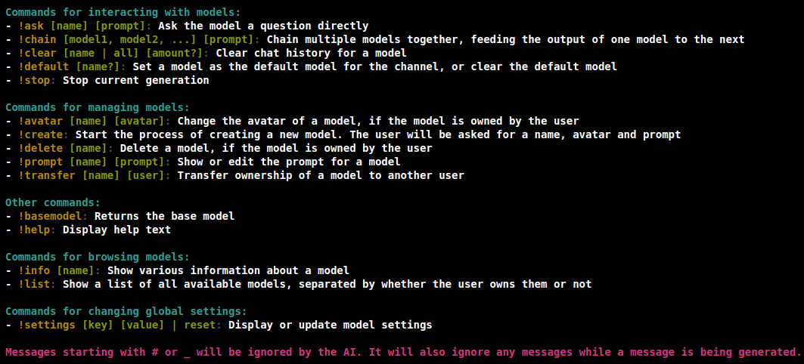

Discord AI Chars is a bot that can switch between models and send AI-generated messages via webhooks. It uses the Ollama library to generate the AI responses. Users in your server have the ability to create and customize their characters and even have them talk to each other.





Software:

- [Node.js](https://nodejs.org/)
- [Ollama](https://ollama.com/download)

Hardware:

For high performance, a GPU is recommended.

(For 8b models like `dolphin-llama3:8b`)

- GPU: Atleast 6GB VRAM
- CPU: Atleast 16GB of RAM and 4 cores

Please do your own research on the requirements for the models you want to use.


Doing this will clone the repository, install the dependencies, and create a `.env` file automatically, then run the bot.

If you want to do it manually, follow the `Manual Setup Section` below.

## Linux/macOS:

```sh
sh -c "$(curl -sS https://raw.githubusercontent.com/LeonhardTissen/discordAIChars/master/installer/install.sh)"
```

## Windows:

- [Run this batch file](https://raw.githubusercontent.com/LeonhardTissen/discordAIChars/master/installer/install.bat)


1. Clone the repository

```sh
git clone https://github.com/LeonhardTissen/discordAIChars.git
```

2. Change into the directory

```sh
cd discordAIChars
```

3. Install the dependencies

```sh
npm i
```

4. Create a [Discord bot](https://discord.com/developers/applications) and invite it to your server. Make sure it has the `Manage Webhooks` permission and all intents enabled

5. Copy `example.env` to `.env` and fill in the required values

```env
BOT_TOKEN=YourBotTokenHere
CHANNEL_ID=YourChannelIdHere
BASE_MODEL=dolphin-llama3
IMAGE_RECOGNITION_MODEL=llava-llama3:8b-v1.1-q4_0
PREFIX=!
MAXIMUM_MODEL_CHAIN=5
ADMIN_ID=YourDiscordUserIdHere
```

6. Download the models of your choice from [Ollama](https://ollama.com/library), for example:

```sh
ollama pull dolphin-llama3
ollama pull llava-llama3:8b-v1.1-q4_0
```

7. Run the bot

```sh
node main
```


1. Type `!create` to start the creation of a new model. The bot will ask you for a name, then a profile picture, then the prompt for the model
2. Type `!default [name]` to make that model the default for the channel. Now the bot will respond to all messages in that channel with that model
